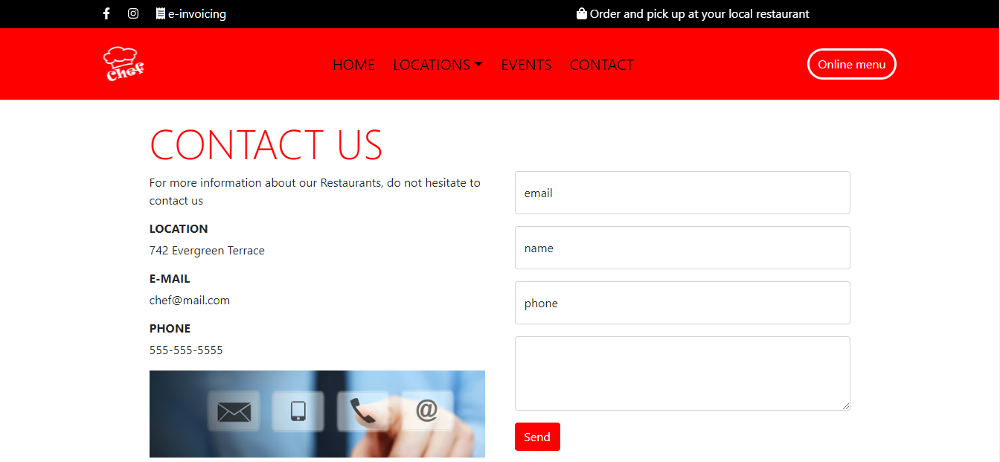

# Restaurant Page

> Restaurant page using javascript.

This project dinamically renders a page when you click on the nav links.

## Built With

- Javascript
- Bootstrap
- NPM Webpack

## Live Demo

[Live Demo Link](https://sjcco.github.io/restaurant-page/)

## Getting Started

- First clone the project by running `git clone https://github.com/sjcco/restaurant-page`.
- Run `npm install` to install the needed .
- Run `npm start` to open in browser.

## Authors

👤 **Author1**

- GitHub: [@sjcco](https://github.com/githubhandle)
- Twitter: [@CarlosCamposO](https://twitter.com/twitterhandle)
- LinkedIn: [jcarlos-campos](https://linkedin.com/jcarlos-campos)

## 🤝 Contributing

Contributions, issues, and feature requests are welcome!

Feel free to check the [issues page](http://github.com/sjcco/restaurant-page/issues/).

## Show your support

Give a ⭐️ if you like this project!

## Acknowledgments

- Hat tip to anyone whose code was used
- microverse team

## 📝 License

This project is [MIT](lic.url) licensed.
